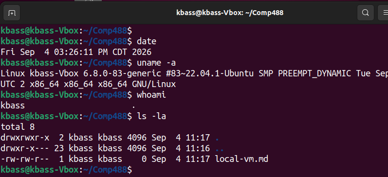

# Local VM Setup Guide

A step-by-step guide for setting up an Ubuntu 22.04 LTS virtual machine using Oracle VirtualBox on a Windows host machine with Git Bash.

---

## Table of Contents
- [System Specifications](#system-specifications)
- [1. Install Git Bash](#1-install-git-bash)
- [2. Install VirtualBox](#2-install-virtualbox)
- [3. Create the Ubuntu VM](#3-create-the-ubuntu-vm)
- [4. Start and Log In](#4-start-and-log-in)
- [5. Login Screenshot](#5-login-screenshot)
- [6. VirtualBox CLI Alternative](#6-virtualbox-cli-alternative)
- [7. System-Specific Notes](#7-system-specific-notes)
- [Contributing](#contributing)
- Appendix -- Usefull commands added by Gregor

---

## System Specifications

| Component | Specification / Version |
| :--- | :--- |
| **Host OS** | Windows with Git Bash |
| **Virtual Machine Software** | Oracle VirtualBox 7.1.4 r165100 |
| **Guest OS** | Ubuntu 22.04.5 LTS |
| **Hostname** | `kbass-vbox` |
| **Course Repository Path** | `E:/workspace/comp488` |

---

## 1. Install Git Bash

1. Download and install **Git for Windows**, which includes Git Bash.
2. Open Git Bash and verify the installation:

```bash
git --version
```

---

## 2. Install VirtualBox

1. Download and install **Oracle VirtualBox** for Windows.
2. Launch VirtualBox after installation to verify that it starts correctly.

---

## 3. Create the Ubuntu VM

Launch VirtualBox and execute the following steps:

1. Click **New**.
2. Set the VM details:
   - **Name:** `Ubuntu 22.04`
   - **Type:** `Linux`
   - **Version:** `Ubuntu (64-bit)`
3. Assign **2–4 GB of RAM** (depending on your host's available memory).
4. Create a virtual hard disk with a capacity of approximately **20 GB**.
5. Select the **Ubuntu 22.04 ISO image** as your installation media.
6. Start the VM and complete the Ubuntu OS installation flow.
7. Create your username and password when prompted.

---

## 4. Start and Log In

1. Start the Ubuntu VM from VirtualBox and log in using your user credentials.
2. Open the Ubuntu Terminal and verify the system hostname:

```bash
hostname
```

> **Target Hostname:** `kbass-vbox`

3. Verify system kernel and operations:

```bash
uname -a
```

4. Check the current working directory:

```bash
ls -la
```

---

## 5. Login Screenshot

> [!NOTE]
> Below is the screenshot verifying a successful login to the Ubuntu VM and execution of terminal commands.
> 



---

## 6. VirtualBox CLI Alternative

VirtualBox includes `VBoxManage`, a command-line interface tool for managing virtual machines.

### List Installed VMs
```bash
VBoxManage list vms
```

### Create VM via Command Line
```bash
VBoxManage createvm --name "Ubuntu 22.04" --ostype "Ubuntu_64" --register
```

> [!NOTE]
> While CLI management is available, the VirtualBox Graphical User Interface (GUI) was used for the primary setup of this VM.

---


## Contributing

If you locate an error in the official lecture notes, please follow standard open-source workflow guidelines to submit a fix:

1. **Fork** the `lecture-notes` repository.
2. **Create a branch** for your fix (`git checkout -b fix/lecture-note-error`).
3. **Make and commit** your changes (`git commit -m "Fix typo in VM setup notes"`).
4. **Push** the branch to GitHub (`git push origin fix/lecture-note-error`).
5. Open a **Pull Request** providing a clear description of the correction.

## Appendix -- Useful commands added by Gregor

Not tested

## 9️⃣ VirtualBox CLI – Full Script (Git Bash)

```bash
# Create the VM and register it
VBoxManage createvm --name "Ubuntu_22.04" --ostype "Ubuntu_64" --register

# Set RAM & video memory
VBoxManage modifyvm "Ubuntu_22.04" --memory 4096 --vram 128

# Create a 25 GB dynamically allocated VDI
VBoxManage createhd --filename "$HOME/VirtualBox VMs/Ubuntu_22.04/Ubuntu_22.04.vdi" \
                    --size 25600 --variant Standard

# Attach the disk to SATA controller
VBoxManage storagectl "Ubuntu_22.04" --name "SATA Controller" --add sata --controller IntelAhci
VBoxManage storageattach "Ubuntu_22.04" --storagectl "SATA Controller" \
                    --port 0 --device 0 --type hdd \
                    --medium "$HOME/VirtualBox VMs/Ubuntu_22.04/Ubuntu_22.04.vdi"

# Attach the Ubuntu ISO as a DVD drive
ISO_PATH="E:/Downloads/ubuntu-22.04.5-live-server-amd64.iso"
VBoxManage storagectl "Ubuntu_22.04" --name "IDE Controller" --add ide
VBoxManage storageattach "Ubuntu_22.04" --storagectl "IDE Controller" \
                    --port 0 --device 0 --type dvddrive --medium "$ISO_PATH"

# (Optional) Enable NAT networking with port‑forwarding for SSH
VBoxManage modifyvm "Ubuntu_22.04" --natpf1 "ssh,tcp,,2222,,22"
```

# 7️⃣ Start the VM in headless mode (or remove `--type headless` to see the GUI)
VBoxManage startvm "Ubuntu_22.04" --type headless
