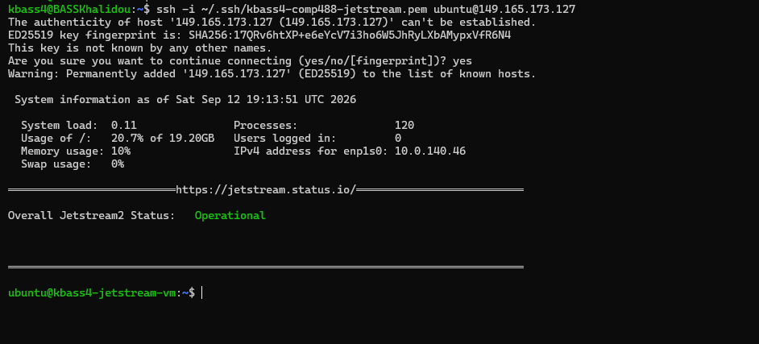

# Week 3.1 — Jetstream Virtual Machine

## Objective

The objective of this assignment was to create and access a virtual machine (VM) on Jetstream and document the configuration and access process.

## 1. Jetstream Access

The Jetstream Horizon portal was accessed through:

- **Jetstream:** [https://js2.jetstream-cloud.org](https://js2.jetstream-cloud.org)
- **Authentication:** ACCESS-CI

## 2. SSH Key Setup

Two SSH key-pair workflows were tested during the setup process.

The initial workflow used an existing local SSH key, with its public key imported into Jetstream. After experiencing SSH connection timeouts, a dedicated SSH key pair was created directly through the Jetstream/OpenStack portal.

The final key pair was named:

`kbass4-comp488-jetstream`

Jetstream generated the key pair, and the private key was downloaded to the local computer. The private key was then copied into WSL Ubuntu at:

```bash
~/.ssh/kbass4-comp488-jetstream.pem
```

The private key permissions were secured using:

```bash
chmod 600 ~/.ssh/kbass4-comp488-jetstream.pem
```

The private key was verified using:

```bash
ssh-keygen -y -f ~/.ssh/kbass4-comp488-jetstream.pem
```

The command successfully generated the corresponding public key, confirming that the downloaded private key was valid and readable.

## 3. Initial Troubleshooting Attempts

Before using the Jetstream-generated key pair, two small Ubuntu instances were created using a locally generated and imported SSH key.

Both instances launched successfully and received Floating IP addresses. However, SSH connections to port 22 timed out.

Example result:

```text
ssh: connect to host 149.165.173.127 port 22: Connection timed out
```

A second instance produced the same timeout. The repeated connection failures indicated that the problem was related to SSH/network access or security-group configuration rather than VM creation itself.

The unsuccessful instances were removed to avoid unnecessarily consuming limited cloud resources.

## 4. Successful VM Configuration

A new VM was created using the Jetstream-generated SSH key pair and the `remotelogin` security group.

| Setting | Value |
| :--- | :--- |
| **Instance name** | kbass4-jetstream-vm |
| **Image** | Featured-Minimal-Ubuntu22 |
| **Flavor** | m3.tiny |
| **vCPUs** | 1 |
| **RAM** | 3 GB |
| **Disk** | 20 GB |
| **Network** | auto_allocated_network |
| **Security group** | remotelogin |
| **SSH key pair** | kbass4-comp488-jetstream |
| **Private IP** | 10.0.140.46 |
| **Floating IP** | 149.165.173.127 |
| **Availability zone** | nova |
| **Status** | Active / Running |

## 5. Successful SSH Connection

The Jetstream VM was accessed from WSL Ubuntu using the private key downloaded from Jetstream.

The following login proof demonstrates the successful SSH connection:

```text
kbass4@BASSKhalidou:~$
kbass4@BASSKhalidou:~$ ssh -i ~/.ssh/kbass4-comp488-jetstream.pem ubuntu@149.165.173.127

The authenticity of host '149.165.173.127 (149.165.173.127)' can't be established.
ED25519 key fingerprint is: SHA256:17QRv6htXP+e6eYcV7i3ho6W5JhRyLXbAMypxVfR6N4
This key is not known by any other names.
Are you sure you want to continue connecting (yes/no/[fingerprint])? yes
Warning: Permanently added '149.165.173.127' (ED25519) to the list of known hosts.

 System information as of Sat Sep 12 19:13:51 UTC 2026

  System load:  0.11               Processes:               120
  Usage of /:   20.7% of 19.20GB   Users logged in:         0
  Memory usage: 10%                IPv4 address for enp1s0: 10.0.140.46
  Swap usage:   0%

══════════════════════════https://jetstream.status.io/══════════════════════════

Overall Jetstream2 Status:   Operational

════════════════════════════════════════════════════════════════════════════════

ubuntu@kbass4-jetstream-vm:~$ ls
```

The SSH command used for the successful connection was:

```bash
ssh -i ~/.ssh/kbass4-comp488-jetstream.pem ubuntu@149.165.173.127
```

The remote terminal prompt changed from the local WSL prompt:

```bash
kbass4@BASSKhalidou:~$
```

to the Jetstream VM prompt:

```bash
ubuntu@kbass4-jetstream-vm:~$
```

This confirms that the connection was successfully established.

### Screenshot: Successful Jetstream VM Login

The screenshot below shows the successful SSH connection to the Jetstream VM and the remote Ubuntu terminal prompt:



The successful configuration used the Jetstream-generated private key together with the `remotelogin` security group, allowing successful SSH access after the earlier connection timeouts.

## 6. VM Verification

After the SSH connection was established, the following commands were available for verifying the remote VM:

- `hostname`
- `whoami`
- `ip addr`
- `df -h`

These commands verify the following information:

- The VM hostname
- The remote username (`ubuntu`)
- The VM's network interfaces and private IP address
- Disk capacity and current usage

## 7. Resource Management

After successful login and verification of the VM, the instance was shut down and deleted to release the allocated resources and prevent unnecessary resource usage.

## Conclusion

The Jetstream virtual machine was successfully created, configured, and accessed remotely through SSH. Successful authentication and access to the Ubuntu terminal verified that the VM and its remote-access configuration were functioning as expected. Following successful verification and completion of the documentation, the VM was shut down and deleted to release the allocated Jetstream resources.